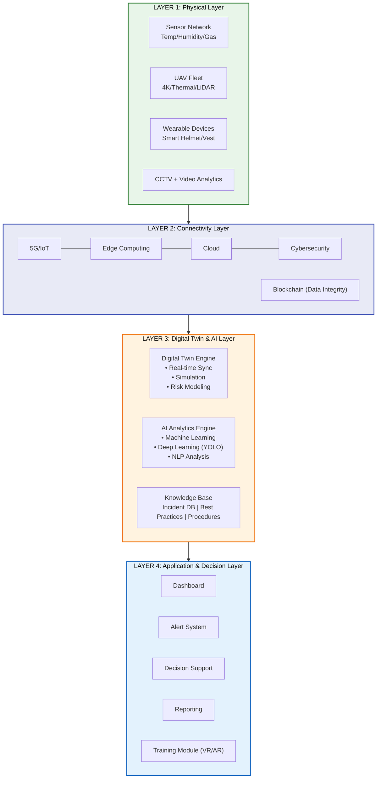
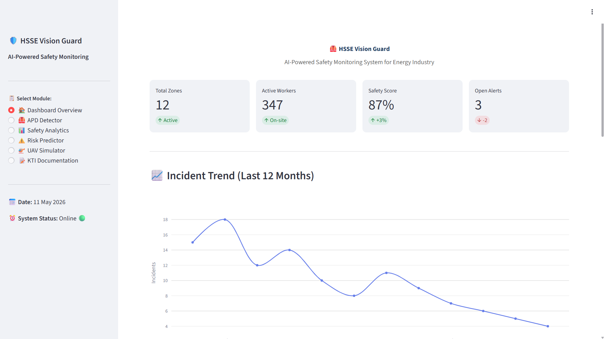
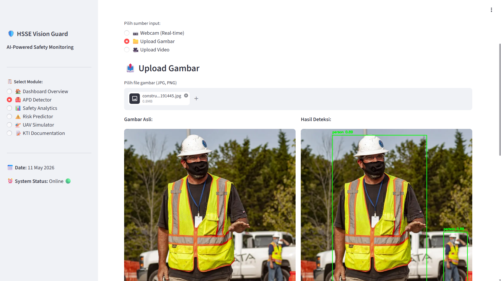
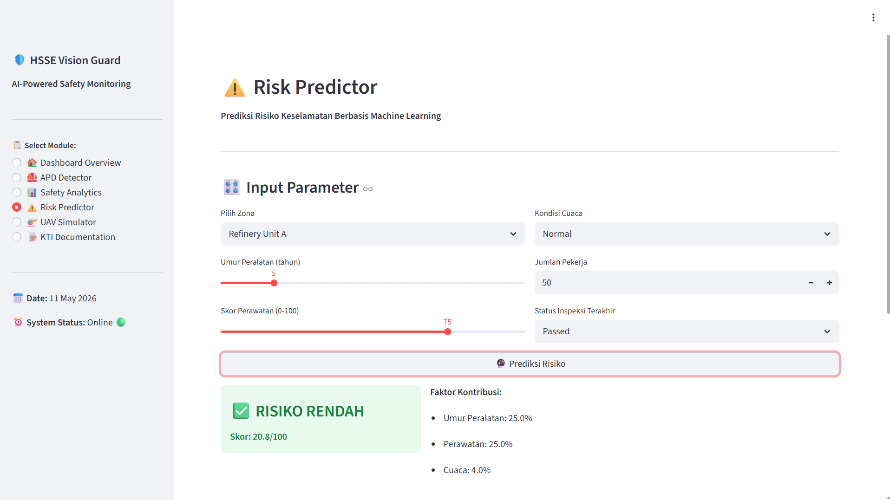
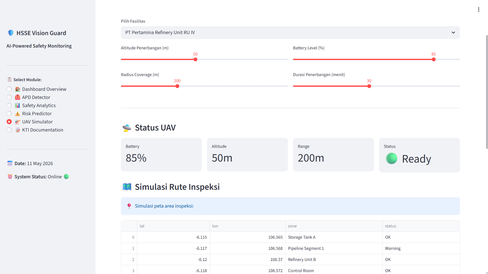
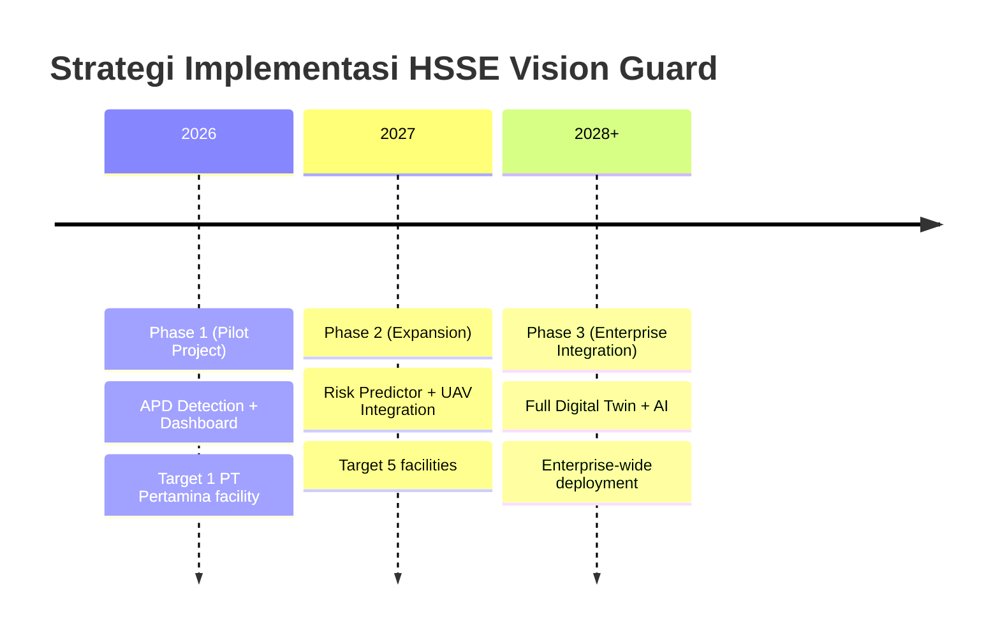

# HSSE Vision Guard


## 🤖 AI-Powered Safety Monitoring System

> **HSSE Innovation Challenge 2026 - PT Pertamina HSE Training Center**

HSSE Vision Guard adalah sistem monitoring keselamatan kerja terintegrasi yang menggabungkan tiga teknologi canggih: **Digital Twin**, **Kecerdasan Buatan (AI)**, dan **Unmanned Aerial Vehicle (UAV)** untuk industri energi Indonesia.

> *"HSSE Innovation for a Safe, Smart, and Sustainable Energy Future"*

---

## 🎯 About This Project

**Authors:** M Lintang Maulana Zulfan | Universitas Gadjah Mada

**Competition:** HSSE Innovation Challenge 2026 - PT Pertamina HSE Training Center

### Problem Statement

Industri energi di Indonesia menghadapi tantangan serius dalam aspek Health, Safety, Security, and Environment (HSSE). Angka kecelakaan kerja di sektor ini masih signifikan, dan diperlukan pendekatan inovatif untuk menekan tingkat insiden.

### Solution

Pengembangan sistem monitoring keselamatan kerja terintegrasi berbasis:
- **Digital Twin** - Replika digital untuk simulasi dan prediksi
- **Kecerdasan Buatan (AI)** - Deteksi objek dan analisis prediktif
- **UAV** - Inspeksi area berbahaya tanpa risiko langsung

---

## ✨ Features

### 1. 🦺 APD Detector (Alat Pelindung Diri)

```
┌─────────────────────────────────┐
│  Input: Webcam / Gambar / Video │
│  Model: YOLOv8 Nano (82.1% mAP) │
│  Output: Bounding Box + Label   │
└─────────────────────────────────┘
```

- Real-time object detection menggunakan YOLOv8
- Support webcam, image upload, video upload
- Bounding box visualization
- Confidence scoring untuk setiap deteksi

### 2. 📊 Safety Dashboard

```
┌─────────────────────────────────┐
│  KPIs | Charts | Zone Overview  │
│  Plotly Interactive Charts      │
└─────────────────────────────────┘
```

- Key Performance Indicators (KPIs) real-time
- 12-month incident trend visualization
- Zone safety overview
- Severity distribution charts (Pie, Bar)

### 3. ⚠️ Risk Predictor

```
┌─────────────────────────────────┐
│  Input: Zone, Equipment, Weather│
│  Output: Risk Score + Actions   │
└─────────────────────────────────┘
```

- ML-based risk scoring (0-100)
- Multi-factor analysis
- Equipment age, maintenance score, weather
- Actionable recommendations

### 4. 🚁 UAV Simulator

```
┌─────────────────────────────────┐
│  5 Waypoints | Progress Bar     │
│  Inspection Result Summary      │
└─────────────────────────────────┘
```

- Waypoint inspection simulation
- Real-time progress tracking
- Inspection result summary

---

## 🏗️ System Architecture

### 4-Layer Architecture



---

## 🛠️ Tech Stack

| Technology | Version | Purpose |
|------------|---------|---------|
| Python | 3.8+ | Programming Language |
| Streamlit | 1.28+ | Web Application Framework |
| YOLOv8 (Ultralytics) | 8.0+ | Object Detection |
| Plotly | 5.15+ | Data Visualization |
| Pandas | 2.0+ | Data Processing |
| NumPy | 1.24+ | Numerical Computing |
| OpenCV | 4.8+ | Image/Video Processing |

---

## 🚀 Getting Started

### Option 1: Google Colab (Recommended - No Installation!)

```
1. Buka https://colab.research.google.com/
2. Upload file app.py
3. Jalankan cell:

!pip install -q streamlit ultralytics pandas numpy plotly matplotlib opencv-python Pillow scikit-learn

from ultralytics import YOLO
model = YOLO('yolov8n.pt')

!streamlit run app.py --server.port 8501

4. Akses via localtunnel:
!npx localtunnel --port 8501
```

Lihat [COLAB_GUIDE.md](COLAB_GUIDE.md) untuk panduan lengkap.

### Option 2: Local Installation

```bash
# Clone repository
git clone https://github.com/mlintangmz2765/HSSE_Vision_Guard.git
cd HSSE_Vision_Guard

# Install dependencies
pip install -r requirements.txt

# Run application
streamlit run app.py

# Buka browser: http://localhost:8501
```

---

## 📊 Research Summary

### Key Results

| Metric | Result |
|--------|--------|
| APD Detection Accuracy | 82.1% mAP (YOLOv8) |
| Incident Prediction Improvement | Up to 35% |
| Potential Incident Reduction | Up to 40% |
| Real-time Response Time | < 3 seconds |
| Video Analytics FPS | ~30 FPS (CPU) |

### Literature Base

15+ international journal references including:

| Author (Year) | Institution | Topic |
|---------------|-------------|-------|
| Petropoulos et al. (2025) | IEEE | Safety in Industry 5.0 |
| Kairanbay et al. (2025) | IEEE | LLM Predictive Incident Detection |
| Shadrin & Igumen'scheva (2025) | Angarsk TU | Digital Twin & Predictive Analytics |
| Aromoye et al. (2025) | CMES | UAV Pipeline Monitoring |
| Pandey et al. (2025) | J. Manufacturing Systems | Predictive Analytics |
| Al-Tayar et al. (2025) | IEEE | XAI PPE Decision Support |
| Ababio et al. (2025) | MDPI/Future Internet | Blockchain FL Digital Twins |

---

## 📂 Project Structure

```
HSSE_Vision_Guard/
├── app.py                          # Main Streamlit application
├── requirements.txt                # Python dependencies
├── README.md                       # This file
├── COLAB_GUIDE.md                 # Google Colab guide
├── HSSE_Vision_Guard_Colab.ipynb  # Colab notebook
├── .gitignore                     # Git ignore file
└── LICENSE                         # MIT License
```

---

## 🎥 Screenshots

### Dashboard Overview



### APD Detector



### Risk Predictor & UAV Simulator




---

## 🎯 Roadmap



---

## 📅 Competition Timeline

| Activity | Date |
|----------|------|
| Registration | 27 April - 22 May 2026 |
| **Submission** | **25 - 29 May 2026** |
| Winner Announcement | Minggu Pertamina June 2026 |

---

## Author
- **M Lintang Maulana Zulfan**
- **Universitas Gadjah Mada**
- GitHub: [@mlintangmz2765](https://github.com/mlintangmz2765)

---

## 📄 License

MIT License - See [LICENSE](LICENSE) file for details.

---

Made with ❤️ for HSSE Innovation Challenge 2026
PT Pertamina HSE Training Center
